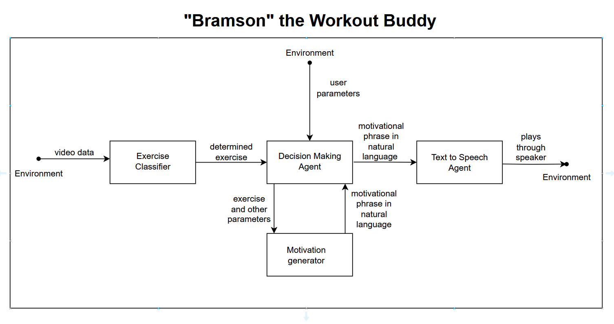

# 🏋️‍♂️ Bramson — The AI Motivational Gym Bro  

**Bramson** is your virtual workout buddy that not only recognizes your exercises in real time but also hypes you up with motivational phrases — just like your gym bro would.  

This repository contains the ongoing development of Bramson’s components: from exercise classification to motivational text generation and text-to-speech output.  

---

## 🔎 How It Works  

Bramson connects computer vision, machine learning, and natural language generation into a full motivational loop:  

1. **Exercise Classifier**  
   - Takes in live video data (via webcam).  
   - Uses [MediaPipe Pose](https://developers.google.com/mediapipe/solutions/vision/pose) and a trained ML model to classify which exercise you’re performing.  

2. **Decision Making Agent**  
   - Processes the identified exercise + user parameters (e.g., progress, workout context).  
   - Decides what type of feedback or motivation should be delivered.  

3. **Motivation Generator**  
   - Produces short, natural-language motivational phrases (e.g., “Keep pushing!”, “Last rep, make it count!”).  
   - Can adapt phrases depending on the exercise and workout context.  

4. **Text-to-Speech Agent**  
   - Converts motivational text into speech.  
   - Plays audio through your speakers in real-time.  

---

## 🖼️ System Architecture  

Here’s the high-level architecture of Bramson:  

  

---

## ✨ Features  

- Real-time pose detection using MediaPipe.  
- Exercise classification with scikit-learn models.  
- Dynamic motivational phrase generation.  
- Text-to-Speech integration for a full “gym buddy” effect.  
- Modular pipeline — each component (classifier, decision agent, TTS) can be improved independently.  

---

## 🚀 Current Status  

- ✅ Exercise classification working on webcam feed.  
- ✅ Model training pipeline built with extracted joint angle features.  
- ⚙️ Motivation generator in progress.  
- ⚙️ Text-to-Speech agent integration in progress.  

---

## 📌 Roadmap  

- [ ] Improve exercise classification by including temporal sequence data.  
- [ ] Expand motivational phrase library.  
- [ ] Add personalization (e.g., user-defined workout plans, preferred motivation style).  
- [ ] Deploy as a desktop or mobile application.  

---

## 🧑‍💻 Development  

Clone the repository and install dependencies:  

```bash
git clone https://github.com/yourusername/bramson.git
cd bramson
pip install -r requirements.txt
```

Run the live webcam demo:  

```bash
python src/streamLandmarker.py
```

---

## 💡 Inspiration  

Bramson is designed to be the hype-man you wish you always had — one that recognizes your grind and pushes you to keep going.  
